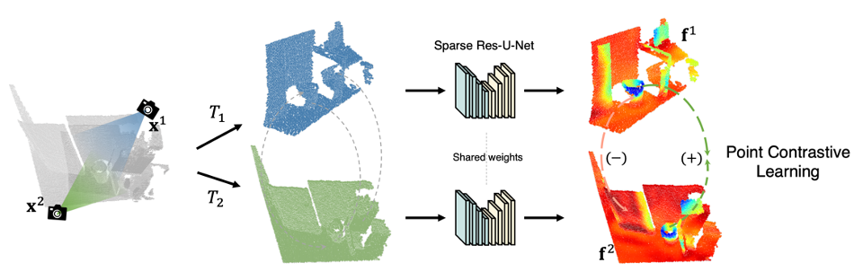

# PointContrast: Unsupervised Pre-training for 3D Point Cloud Understanding

Arguably one of the top success stories of deep learning is transfer learning. The finding that pre-training a network on a rich source set (e.g., ImageNet) can help boost performance once fine-tuned on a usually much smaller target set, has been instrumental to many applications in language and vision. Yet, very little is known about its usefulness in 3D point cloud understanding. We see this as an opportunity considering the effort required for annotating data in 3D. In this work, we aim at facilitating research on 3D representation learning. Different from previous works, we focus on high-level scene understanding tasks. To this end, we select a suite of diverse datasets and tasks to measure the effect of unsupervised pre-training on a large source set of 3D scenes. Our findings are extremely encouraging: using a unified triplet of architecture, source dataset, and contrastive loss for pre-training, we achieve improvement over recent best results in segmentation and detection across 6 different benchmarks for indoor and outdoor, real and synthetic datasets – demonstrating that the learned representation can generalize across domains. Furthermore, the improvement was similar to supervised pre-training, suggesting that future efforts should favor scaling data collection over more detailed nnotation. We hope these findings will encourage more research on unsupervised pretext task design for 3D deep learning.


[[ECCV 2020 Paper]](https://arxiv.org/abs/2007.10985) [[Spotlight Talk]](https://www.youtube.com/watch?v=MSWfDnnQ8kg)





## Environment
This codebase was tested with the following environment configurations.
- Ubuntu 14.04
- CUDA 10.2
- Python v3.7
- Pytorch v1.5
- [MinkowskiEngine](https://github.com/stanfordvl/MinkowskiEngine) v0.4.3 (Note: The original experiments were conducted with ME v0.3.3; ME v0.5 above might provide a substantial [speed up](https://github.com/chrischoy/MinkowskiEngineBenchmark) but it requires additional [migration](https://github.com/NVIDIA/MinkowskiEngine/wiki/Migration-Guide-from-v0.4.x-to-0.5.x).)


## Installation & Dataset Processin

We use conda for the installation process:
```
conda create -n pc_env python=3.7
conda activate pc_env
conda install pytorch -c pytorch
Download code from https://github.com/NVIDIA/MinkowskiEngine/releases/tag/v0.4.3, compile and install MinkowskiEngine.
```


Next, download PointContrast git repository and install the requirement from the PointContrast root directory..

```
git clone https://github.com/facebookresearch/PointContrast.git
cd PointContrast
pip install -r requirements.txt
```


Our code also depends on [Hydra](https://github.com/facebookresearch/hydra), a framework for experiment configurations.
```
# Install Hydra by:
pip install hydra-core --upgrade
```

For pre-training, a set of preprocessing tools are provided in PointContrast/pretrain/data_preprocess/. Follow the README file there to generate the ScanNet Pair Dataset. For *debugging purpose only*, we provide an example dataset that can be downloaded [here](https://www.dropbox.com/s/9ppm0s4veow0yst/data_f25.tar?dl=0). Extract the example dataset to ``example_dataset/``. The pair list for training is provided at ``example_dataset/overlap-30-50p-subset.txt``. This will help you walk through the training process though it can only offer dummy results.

Our codebase enables multi-gpu training with distributed data parallel (DDP) module in pytorch. 
To train PointContrast with 8 GPUs (batch_size=32, 4 per GPU) on a single server:
```
cd pretrain/pointcontrast
./scripts/ddp_local.sh
```
You should edit OUT_DIR and data.dataset_root_dir in the ddp_local.sh file, accoding to your local paths, before running the experiments.
Our codebase also supports training on cluster with SLURM, see ``scripts/ddp_launch.sh`` for reference.


## Finetuning: Segmentation and Detection
We also provide code for the segmentation and detection experiments conducted in our paper. The finetuning code for semantic segmentation is mostly a direct fork of [SpatioTemporalSegmentation](https://github.com/chrischoy/SpatioTemporalSegmentation) with modifications to support **multi-gpu training**.

For example, for Stanford 3D semantic segmentation task:
- Download the stanford 3d dataset from the [website](http://buildingparser.stanford.edu/dataset.html).
- Preprocess: Modify the input and output directory accordingly in ``lib/datasets/preprocessing/stanford.py`` and run ``python -m lib.datasets.preprocessing.stanford``
- Train: 
    ```
    # Edit relevant path variables and then run:
    ./scripts/train_stanford3d.sh 
    ```
## Pretrained PointContrast Model:
(Coming soon)

## Citing PointContrast
```
@inproceedings{PointContrast2020,
    author = {Saining Xie, Jiatao Gu, Demi Guo, Charles R. Qi, Leonidas Guibas, Or Litany},
    title = {PointContrast: Unsupervised Pre-training for 3D Point Cloud Understanding},
    booktitle = {ECCV},
    year = {2020},
}
```

## License
PointContrast is relased under the MIT License. See the LICENSE file for more details.

## Acknowledgements
This codebase was built on top of [FCGF]() and [MinkowskiEngine](), we thank Chris Choy for helping us setting up the codebase. 
We thank [Ji Hou]() at TUM for helping with the Hydra setup and code migration to ME 0.4. 
